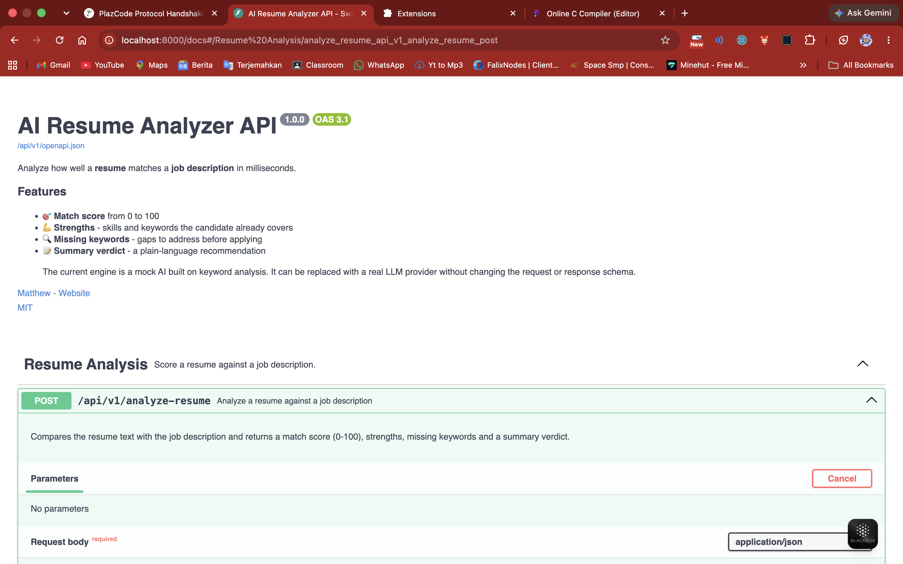
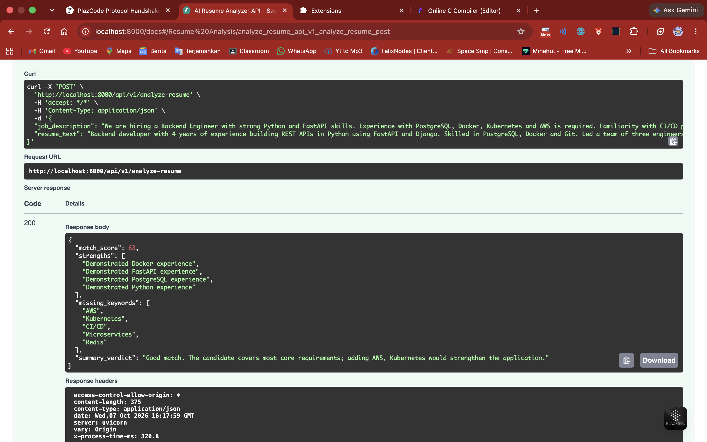

<h1 align="center">🧠 AI Resume Analyzer API</h1>

  <b>Score any resume against any job description with one API call.</b>

  
  
  
  
  
  

---

## 🚀 Value Proposition

Recruiters and job seekers waste hours manually comparing resumes to job posts. This API returns an instant **match score, strengths, missing keywords, and a clear verdict**, ready to plug into any ATS, job board, or career-coaching app.

## ✨ Features

- 🎯 **`POST /api/v1/analyze-resume`** - match score (0-100), strengths, missing keywords, summary verdict
- ✅ **Strict validation** with Pydantic v2 (length limits, whitespace trimming, clear 422 errors)
- 📚 **Full interactive docs** - Swagger UI at `/docs` and ReDoc at `/redoc`, with request/response examples
- 🌐 **CORS ready** - configurable allowed origins via environment variable
- ⏱️ **Observability** - request logging and an `X-Process-Time-Ms` response header
- ❤️ **Health check** endpoint at `/health`
- 🔌 **LLM-ready** - the mock AI engine can be swapped for OpenAI, Gemini, or any model without changing the API contract

## 🧰 Tech Stack

| Tool | Purpose |
| --- | --- |
| [FastAPI](https://fastapi.tiangolo.com/) | High-performance async web framework |
| [Pydantic v2](https://docs.pydantic.dev/) | Request/response validation and schemas |
| [Uvicorn](https://www.uvicorn.org/) | ASGI server |
| [Swagger UI / ReDoc](https://swagger.io/tools/swagger-ui/) | Auto-generated interactive documentation |

## ⚡ Quickstart

**1. Clone the repo**

~~~bash
git clone https://github.com/matthewdotcom/resume-analyzer-api.git
cd resume-analyzer-api
~~~

**2. Install dependencies**

~~~bash
python3 -m venv .venv
source .venv/bin/activate      # Windows: .venv\Scripts\activate
pip install -r requirements.txt
~~~

**3. Run the server**

~~~bash
uvicorn main:app --reload
~~~

**4. Open the docs** at [http://localhost:8000/docs](http://localhost:8000/docs) and click **Try it out**.

## 📡 API Usage

### Request

~~~bash
curl -X POST http://localhost:8000/api/v1/analyze-resume \
  -H "Content-Type: application/json" \
  -d '{
    "resume_text": "Backend developer with 4 years of experience building REST APIs in Python using FastAPI and Django. Skilled in PostgreSQL, Docker and Git. Led a team of three engineers in an Agile environment and improved API response times by 40 percent.",
    "job_description": "We are hiring a Backend Engineer with strong Python and FastAPI skills. Experience with PostgreSQL, Docker, Kubernetes and AWS is required. Familiarity with CI/CD pipelines, Redis and microservices is a plus."
  }'
~~~

### Response

~~~json
{
  "match_score": 63,
  "strengths": [
    "Demonstrated Docker experience",
    "Demonstrated FastAPI experience",
    "Demonstrated PostgreSQL experience",
    "Demonstrated Python experience"
  ],
  "missing_keywords": ["AWS", "Kubernetes", "CI/CD", "Microservices", "Redis"],
  "summary_verdict": "Good match. The candidate covers most core requirements; adding AWS, Kubernetes would strengthen the application."
}
~~~

### Endpoints

| Method | Path | Description |
| --- | --- | --- |
| `POST` | `/api/v1/analyze-resume` | Analyze a resume against a job description |
| `GET` | `/health` | Service health check |
| `GET` | `/docs` | Swagger UI |
| `GET` | `/redoc` | ReDoc documentation |

### Configuration

| Variable | Default | Description |
| --- | --- | --- |
| `ALLOWED_ORIGINS` | `*` | Comma-separated CORS origins, e.g. `https://myapp.com,http://localhost:3000` |
| `SIMULATED_LATENCY` | `0.4` | Max simulated AI processing time in seconds (`0` to disable) |
| `LOG_LEVEL` | `INFO` | Logging level |
| `PORT` | `8000` | Port when running `python main.py` |

## 🖼️ Screenshots

> _Add your screenshots here._

| Swagger UI | Example Response |
| --- | --- |
|  |  |

## 🗂️ Project Structure

~~~text
.
├── main.py             # FastAPI app: schemas, mock AI engine, routes, middleware
├── requirements.txt    # Python dependencies
└── README.md
~~~

## 🛣️ Roadmap

- [ ] Plug in a real LLM provider (OpenAI / Gemini)
- [ ] PDF and DOCX resume upload
- [ ] API key authentication and rate limiting
- [ ] Docker image and cloud deployment

## 🤝 Contributing

Pull requests are welcome. For major changes, please open an issue first to discuss what you would like to change.

## 📄 License

[MIT](LICENSE)
